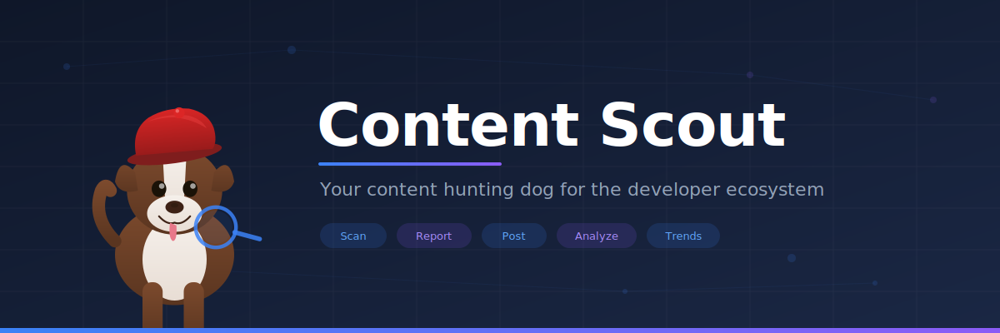

<p align="center">
  
</p>

# Content Scout

A content research agent that discovers, catalogs, and promotes public content about your product, technology, open-source project, or tool across the developer ecosystem. Run it **interactively in your editor** (VS Code, Claude Code, Cursor, and more). Content Scout scans 14+ public sources, filters for quality, generates reports with topic tags and trends, and drafts ready-to-post social media content — all configured through a single onboarding conversation. Track one topic or many from the same workspace.

## Who It's For

| Role | What You Get |
|------|-------------|
| **Program Manager** | Adoption metrics, SDK language breakdown, feature mention frequency, feature request flagging, ecosystem health, month-over-month trajectory |
| **Product Manager** | Competitor signals, feature request & pain point flagging, customer sentiment, market signals |
| **Social Media Manager** | Engagement scoring, platform-specific timing, auto-generated posts with posting calendar, trending topics, conversation sentiment |
| **Product Marketer** | Launch coverage tracker, analyst mentions, customer success stories, competitive landscape, open CFPs, campaign amplification, feature request flagging, customer sentiment |
| **Developer Advocate** | Rising contributor tracking, community projects, conference content, open CFPs, tutorials, SDK adoption, auto-generated posts |
| **Community Manager** | Sentiment breakdown, unanswered question tracking, new contributor spotlights, engagement trends, community health |
| **Technical Writer** | FAQ pattern extraction, doc confusion signals, tutorial gap analysis, community vs. official doc coverage ratio, conversation sentiment |

Select one role, multiple roles (merged), or define a custom role during onboarding.

## Supported AI Coding Tools

Content Scout works in any AI coding tool that supports custom instructions. The agent definition lives in `.github/agents/content-scout.agent.md` — each tool gets a thin adapter file that points there.

| Tool | Instruction file | Setup |
|------|-----------------|-------|
| **VS Code Copilot** | `.github/agents/content-scout.agent.md` | Switch to Content Scout agent mode |
| **Claude Code** | `CLAUDE.md` | Auto-loaded when you open the repo |
| **GitHub Copilot CLI** | `.github/copilot-instructions.md` | Auto-loaded by Copilot CLI |
| **Cursor** | `.cursor/rules/content-scout.mdc` | Auto-loaded as project rules |
| **Windsurf** | `.windsurfrules` | Auto-loaded when you open the repo |
| **Cline** | `.clinerules` | Auto-loaded when you open the repo |

All adapters reference the same agent definition — zero duplication. Commands work the same everywhere:

| VS Code | Other tools (natural language) |
|---------|-------------------------------|
| `/scout-onboard` | "scout onboard" or "set up content scout" |
| `/scout-scan` | "scout scan" or "scan for content" |
| `/scout-post` | "scout post" or "generate social posts" |
| `/scout-calendar` | "scout calendar" or "create posting schedule" |
| `/scout-gaps` | "scout gaps" or "find content gaps" |
| `/scout-trends` | "scout trends" or "show trends" |

## Quick Start

```
git clone https://github.com/jaydestro/content-scout.git
cd content-scout
```

### VS Code
```
code .
```
1. Switch to the **Content Scout** agent mode in Copilot Chat
2. Run `/scout-onboard` — choose **quick setup** (3 questions) or **full setup** (detailed customization)
3. Run `/scout-scan` to discover content

### Claude Code
```
claude
```
1. Say "scout onboard" — the agent reads `CLAUDE.md` automatically
2. Say "scout scan" to discover content

### Cursor / Windsurf / Cline
1. Open the repo in your tool — instructions load automatically
2. Say "scout onboard" to configure
3. Say "scout scan" to discover content

### GitHub Copilot CLI
```
gh copilot
```
1. Say "scout onboard" to configure
2. Say "scout scan" to discover content

Your config saves to `.github/prompts/scout-config-{slug}.prompt.md` (gitignored). API keys are stored in `.env` (also gitignored) — see `.env.example` for the template. See the [workflow guide](docs/WORKFLOW.md) for the full onboarding walkthrough.

## Commands

| Command | What It Does |
|---------|-------------|
| `/scout-onboard` | Set up the agent for a new product, technology, or project (interactive, quick or full setup) |
| `/scout-scan` | Scan for content — specify a topic slug or scan all |
| `/scout-post` | Generate social posts from a URL or report item number |
| `/scout-calendar` | Create a weekly posting schedule |
| `/scout-gaps` | Show topics with no recent coverage |
| `/scout-trends` | Compare trends across months — trajectory, rising/declining topics, contributor patterns |

## What It Scans

14 standard sources plus optional custom sources (vendor blogs, update feeds, docs, influencer blogs):

**No auth needed:** Dev.to, Medium, Hashnode, DZone, C# Corner, InfoQ, GitHub, Stack Overflow, Hacker News, LinkedIn
**Free auth:** YouTube (API key), Reddit (OAuth2 app credentials), Bluesky (app password)
**Paid auth:** X/Twitter ($200/mo Basic plan recommended — best-effort scanning attempted without key)

All API keys are optional — without them, the agent skips those sources and scans everything else. Keys are stored in `.env` at the workspace root (not in config files). See [API Keys](docs/API-KEYS.md) for setup details and [Content Sources](docs/SOURCES.md) for the full source reference.

## How It Works

1. **Onboard** — configure your topic (product, technology, project, or tool), role(s), sources, brand identity, and social post standards
2. **Scan** — the agent searches all sources, applies quality filters (relevancy, dedup, scoring), finds open CFPs and recent conference talks, and produces a numbered report
3. **Post** — generates platform-specific social posts with brand name enforcement and thumbnail specs
4. **Analyze** — content gap analysis, monthly trends, sentiment tracking, contributor patterns

Reports adapt based on topic type — products get SDK adoption tracking, technologies get ecosystem/library tracking, projects get contributor/release tracking, and tools get integration/plugin tracking.

Reports save to `reports/`, social posts to `social-posts/`. Everything is markdown you can review, edit, and version control.

See [Workflow](docs/WORKFLOW.md) for the detailed end-to-end guide and [Architecture](docs/ARCHITECTURE.md) for quality filters, subagent dispatch, and thumbnail generation.

## Adapting for Your Topic

This agent is a template. Clone it, run onboarding (`/scout-onboard` in VS Code, or say "scout onboard" in other tools), and answer the questions for your product, technology, or project. The agent generates a config file with your search terms, excluded channels, brand assets, topic tags, and social post standards. All commands use that config automatically.

**Multiple topics:** Run onboarding again to add another topic. Each gets its own config file (`scout-config-{slug}.prompt.md`) and separate reports. Shared settings (role, brand, networks) can be reused. Pass a slug to any command (e.g., "scout scan cosmos-db", "scout scan python") or scan all at once.

**Topic types:** Content Scout supports products (Azure Cosmos DB), technologies (Python), open-source projects (Ollama), and tools (Copilot CLI). Each type adapts the report sections and search strategy automatically.

See [example-config.md](examples/example-config.md) for a completed configuration using Azure Cosmos DB.

## File Structure

```
CLAUDE.md                                  # Claude Code instructions
.clinerules                                # Cline instructions
.windsurfrules                             # Windsurf instructions
.cursor/
└── rules/
    └── content-scout.mdc                  # Cursor rules
.github/
├── copilot-instructions.md                # GitHub Copilot CLI instructions
├── agents/
│   └── content-scout.agent.md             # Agent definition (single source of truth)
└── prompts/
    ├── scout-onboard.prompt.md            # Onboarding wizard
    ├── scout-config-example.prompt.md     # Example config template (committed)
    ├── scout-config-{slug}.prompt.md      # Your config (gitignored)
    ├── scout-scan.prompt.md               # Content scan
    ├── scout-post.prompt.md               # Social post generation
    ├── scout-calendar.prompt.md           # Posting calendar
    ├── scout-gaps.prompt.md               # Gap analysis
    └── scout-trends.prompt.md             # Trends analysis
docs/
├── WORKFLOW.md                            # End-to-end workflow guide
├── SOURCES.md                             # Content sources reference
├── API-KEYS.md                            # API key setup instructions
├── ARCHITECTURE.md                        # Subagents, quality filters, thumbnails
└── assets/                                # Banner images
reports/                                   # Monthly content & trends reports
social-posts/                              # Generated posts, calendars, thumbnails
examples/                                  # Sample outputs (config, report, posts, calendar)
.env.example                               # API key template (copy to .env)
```

## Examples

The [`examples/`](examples/) folder contains sample outputs using Azure Cosmos DB:

| File | What It Shows |
|------|--------------|
| [example-config.md](examples/example-config.md) | Completed product configuration |
| [example-report.md](examples/example-report.md) | Monthly content report (18 items) |
| [example-social-posts.md](examples/example-social-posts.md) | LinkedIn and X posts with multiple angles |
| [example-posting-calendar.md](examples/example-posting-calendar.md) | 2-week posting schedule |

## Documentation

| Doc | What's In It |
|-----|-------------|
| [Workflow](docs/WORKFLOW.md) | End-to-end guide: onboarding, scanning, posting, analysis, monthly ops |
| [Content Sources](docs/SOURCES.md) | All 14 standard sources, custom sources, scanning order |
| [API Keys](docs/API-KEYS.md) | YouTube, Bluesky, X/Twitter setup instructions and costs |
| [Architecture](docs/ARCHITECTURE.md) | Subagent dispatch, quality filters, GitHub filters, thumbnail generation |
| [Hosted Agent](docs/HOSTED-AGENT.md) ⚠️ *experimental* | Deploy as a Foundry hosted agent for automated/scheduled scanning (preview) |

## Contributing

See [CONTRIBUTING.md](CONTRIBUTING.md) for guidelines.

## License

MIT
